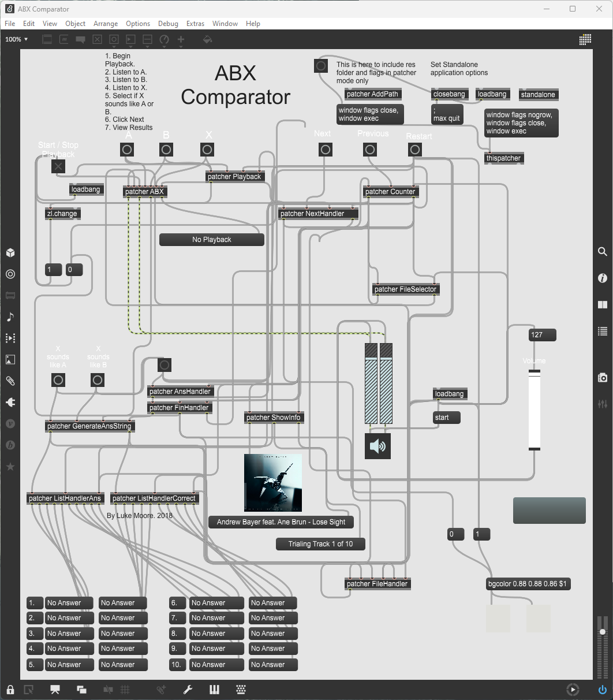
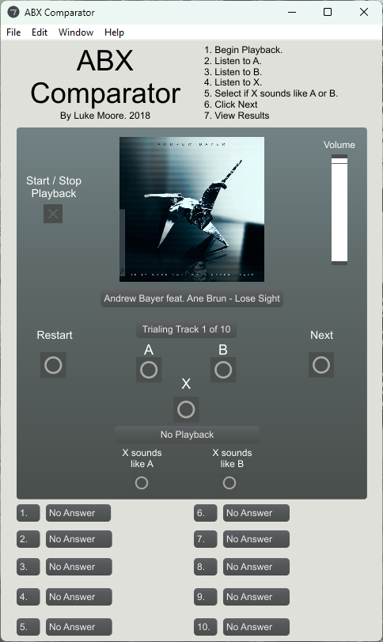

# ABX Comparator
A Comparator developed for [ABX testing](https://en.wikipedia.org/wiki/ABX_test) the perceputual differences encountered when encoding stereo music using the [OPUS format](https://opus-codec.org/) at a bitrate of `64kb/s` using the OPUS reference codec.

This application is built upon [Cycling '74](https://cycling74.com/)'s [Max](https://cycling74.com/downloads) platform, which is an interactive visual patching environment specialized for making audio software.

## Requirements
- Max 8 or above is required to run the patch file (`ABX.maxpat`) directly.
- Windows 7 or above. You may require the [Update for Visual C++ 2013 and Visual C++ Redistributable Package](https://support.microsoft.com/en-us/topic/update-for-visual-c-2013-and-visual-c-redistributable-package-5b2ac5ab-4139-8acc-08e2-9578ec9b2cf1) if you encounter any missing DLL errors at runtime.
- MacOS X Snow Leopard or above.

## The Code
Viewing the patch file directly does not allow one to glean much information about the source code. It is essentially a declarative JSON formatted file containing what will be run by a C/C++ engine inside of the Max platform instead. The patch file is to be opened and run in [Max](https://cycling74.com/) to view a visual representation of the code:

## The Interface

Run the executable on Windows or the application package on MacOS. This may take some time (though very rare), depending on your system configuration and performance, especially if you are running the standalone versions. This is because a full version of the Max platform is bundled with these versions.

When using the standalone versions, they will automatically choose the current default system sound device for playback. When using the patched version, the currently selected sound device inside Max will be used instead.

Follow the instructions outlined in the top-right hand corner of the interface:
1. Click the **Start / Stop Playback** button to begin playback.
2. A random selection of the current music clip, either **A** or **B** will be played (This prevents bias from the user). You may click the **A** or **B** buttons as desired to switch betwween samples seamlessly.
3. Click the **X** button. X will play back either sample A or sample B, chosen at random.
4. The user must determine if X sounds like A or B. To do so, they must click either the **X sounds like A** button or the **X sounds like B** button.
5. The **Next** button will now be unlocked. If the user clicks it, they will move onto the next sample for comparison. The user cannot go back to reassess completed comparisons.

Repeat this process until all 10 music clips have been tested. After which, yu can view the results either in the GUI, or via the `results.txt` file inside the program directory.

The **Reset** button may be used to reset any results and return to the beginning of the entire process. 

## Fair Use
This application uses 10 x 32 second music clips that consist of copyrighted music, along with their respective album covers. This application was developed for educational and research purposes only, specifically for a research project held at [Murdoch University](https://www.murdoch.edu.au/) in 2018 and thus, does not act as a substitute for accessing the copyrighted works. If the authors of the respective copyrighted works wish to raise a dispute, please contact the author of this application by either raising an issue in this GitHub repository, or via direct contact through the author's [GitHub profile](https://github.com/lukemoore66).